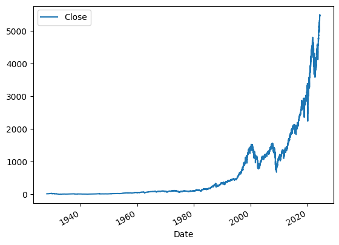
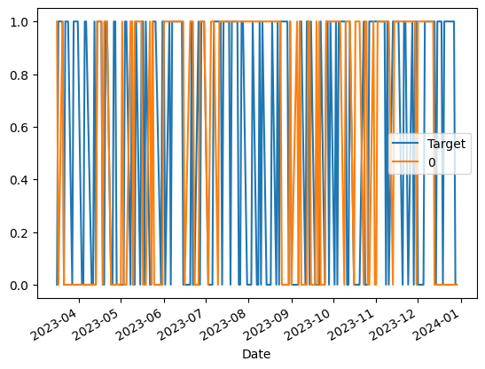

# sp500StockPrediction
## Objective

We want to create a ML model that tries to predict if the stock price will either go up or down, for considering this model succesful it needs to have a performance better than making blind offers.

# Database

We will be using the sp500 database provided by yahoo finance

# Code

## Importing and visualizing the data

### Importing the yfinance library

We make use of the [yfinance](https://pypi.org/project/yfinance/) library to extract our database, the yfinance library allows us to download market data from yahoo finances API

```python
# Importing yfinance
# If not installed already: 
# pip install yfinance
import yfinance as yf
```

### Downloading our dataframe

The data we will be using is the S&P 500 historic stock data, it can be looked at here: https://es.finance.yahoo.com/quote/^GSPC/

```python
# Extract ticker data using ticker() method 
p500 = yf.Ticker("^GSPC")
```

Here we define the variable that will hold our dataframe as sp500, then we use the Ticker() yfinance method, which allows us to access ticker data. 

^GSPC represents the key of the S&P 500, which is what allows us to download the data.

```python
# Get all the historical data
sp500 = sp500.history(period = "max")
```

This line of code etrieves the historical market data for the S&P 500 index over the maximum available period.

### Visualizing the data

```python
# Visualizing the data
sp500
```

**Expected output**

| Open | High | Low | Close | Volume | Dividends | Stock Splits |
| --- | --- | --- | --- | --- | --- | --- |
| Date |  |  |  |  |  |  |
| 1927-12-30 00:00:00-05:00 | 17.660000 | 17.660000 | 17.660000 | 17.660000 | 0 | 0.0 |
| 1928-01-03 00:00:00-05:00 | 17.760000 | 17.760000 | 17.760000 | 17.760000 | 0 | 0.0 |
| 1928-01-04 00:00:00-05:00 | 17.719999 | 17.719999 | 17.719999 | 17.719999 | 0 | 0.0 |
| 1928-01-05 00:00:00-05:00 | 17.549999 | 17.549999 | 17.549999 | 17.549999 | 0 | 0.0 |
| 1928-01-06 00:00:00-05:00 | 17.660000 | 17.660000 | 17.660000 | 17.660000 | 0 | 0.0 |
| ... | ... | ... | ... | ... | ... | ... |
| 2024-06-24 00:00:00-04:00 | 5459.580078 | 5490.660156 | 5447.589844 | 5447.870117 | 3696750000 | 0.0 |
| 2024-06-25 00:00:00-04:00 | 5460.729980 | 5472.879883 | 5446.560059 | 5469.299805 | 3591960000 | 0.0 |
| 2024-06-26 00:00:00-04:00 | 5460.709961 | 5483.140137 | 5451.870117 | 5477.899902 | 3563920000 | 0.0 |
| 2024-06-27 00:00:00-04:00 | 5473.589844 | 5490.810059 | 5467.540039 | 5482.870117 | 3589530000 | 0.0 |
| 2024-06-28 00:00:00-04:00 | 5488.479980 | 5523.640137 | 5451.120117 | 5460.479980 | 7199220000 | 0.0 |

24239 rows × 7 columns

```python
# Visualize our time indexes
sp500.index
```

**Expected output**

```
DatetimeIndex(['1927-12-30 00:00:00-05:00', '1928-01-03 00:00:00-05:00',
               '1928-01-04 00:00:00-05:00', '1928-01-05 00:00:00-05:00',
               '1928-01-06 00:00:00-05:00', '1928-01-09 00:00:00-05:00',
               '1928-01-10 00:00:00-05:00', '1928-01-11 00:00:00-05:00',
               '1928-01-12 00:00:00-05:00', '1928-01-13 00:00:00-05:00',
               ...
               '2024-06-14 00:00:00-04:00', '2024-06-17 00:00:00-04:00',
               '2024-06-18 00:00:00-04:00', '2024-06-20 00:00:00-04:00',
               '2024-06-21 00:00:00-04:00', '2024-06-24 00:00:00-04:00',
               '2024-06-25 00:00:00-04:00', '2024-06-26 00:00:00-04:00',
               '2024-06-27 00:00:00-04:00', '2024-06-28 00:00:00-04:00'],
              dtype='datetime64[ns, America/New_York]', name='Date', length=24239, freq=None)
```

```python
# Plot stock growth over time
sp500.plot.line(y = "Close", use_index = True)
```

**Expected output**



## Cleaning and improving the data

### Deleting columns

```python
# Delete columns we wont be using
del sp500["Dividends"]
del sp500["Stock Splits"]
```

We delete these columns because they are more aimed towards individual trades, however it is not what we are looking to predict.

### Adding new columns

```python
# create column tomorrow that represents the closing price of the stock the next day
sp500["Tomorrow"] = sp500["Close"].shift(-1)
```

This line of code creates a new column “Tomorrow” in the sp500 dataframe, this new column has the data of the “Close” column (which represents the final stock price of the day) shifted -1, what this means is that the current Tomorrow value represents the Close value of the next day.

```python
# Create a column that shows a 0 when the price goes down and a 1 when the price goes up
sp500["Target"] = (sp500["Tomorrow"] > sp500["Close"]).astype(int)
```

We also create a “Target” column, this column return a 0 if the price of the stock goes down (if Close value is bigger than Tomorrow value) or 1 if the price of the stock goes up (if Tomorrow value is bigger than Close value).

### Defining a timeframe for the database

Since we are working with stock data, it would be useful to delete data before a certain time treshhold, to avoid possible errors due to newer data i also decided to delete some very recent data, the timeframe i decided to use is all data between 1990 and 2023, deleting everything before 1990 and after 2023.

```python
# Remove all data before 1990 and after 2024
sp500 = sp500.loc["1990-01-01":"2024-01-01"].copy()
```

We use loc[] to select indexes, since our indexes are dates, we specify the starting index (starting date) and ending index (ending date) of our dataframe, then we use the copy() method to create a deep copy of the selected data, ensuring that any modifications to the resulting dataframe do not affect the original dataframe.

We can visualize the dataframe again.

```python
sp500
```

**Expected output**

|  | Open | High | Low | Close | Volume | Tomorrow | Target |
| --- | --- | --- | --- | --- | --- | --- | --- |
| Date |  |  |  |  |  |  |  |
| 1990-01-02 00:00:00-05:00 | 353.399994 | 359.690002 | 351.980011 | 359.690002 | 162070000 | 358.760010 | 0 |
| 1990-01-03 00:00:00-05:00 | 359.690002 | 360.589996 | 357.890015 | 358.760010 | 192330000 | 355.670013 | 0 |
| 1990-01-04 00:00:00-05:00 | 358.760010 | 358.760010 | 352.890015 | 355.670013 | 177000000 | 352.200012 | 0 |
| 1990-01-05 00:00:00-05:00 | 355.670013 | 355.670013 | 351.350006 | 352.200012 | 158530000 | 353.790009 | 1 |
| 1990-01-08 00:00:00-05:00 | 352.200012 | 354.239990 | 350.540009 | 353.790009 | 140110000 | 349.619995 | 0 |
| ... | ... | ... | ... | ... | ... | ... | ... |
| 2023-12-22 00:00:00-05:00 | 4753.919922 | 4772.939941 | 4736.770020 | 4754.629883 | 3046770000 | 4774.750000 | 1 |
| 2023-12-26 00:00:00-05:00 | 4758.859863 | 4784.720215 | 4758.450195 | 4774.750000 | 2513910000 | 4781.580078 | 1 |
| 2023-12-27 00:00:00-05:00 | 4773.450195 | 4785.390137 | 4768.899902 | 4781.580078 | 2748450000 | 4783.350098 | 1 |
| 2023-12-28 00:00:00-05:00 | 4786.439941 | 4793.299805 | 4780.979980 | 4783.350098 | 2698860000 | 4769.830078 | 0 |
| 2023-12-29 00:00:00-05:00 | 4782.879883 | 4788.430176 | 4751.990234 | 4769.830078 | 3126060000 | 4742.830078 | 0 |

8565 rows × 7 columns

## Creating, training and testing our first model

### Creating the model

```python
from sklearn.ensemble import RandomForestClassifier

model = RandomForestClassifier(n_estimators = 100, min_samples_split = 100, random_state = 1)
```

From sklearn we use the RandomForestClassifier, we give it a 100 n_estimators, which represents the amount of decision trees in the forest, we also give it a 100 min_samples_split, which defines the minimum number of samples required to split an internal node, this is to try and prevent overfitting, lastly we use random_state = 1 to make sure that the result is reproducible, which means that if we run this code again with the same data and parameters, the model should produce the same results.

Why use a random forest? mainly for these 3 reasons.

1. **Robustness to Overfitting**:
    - **Ensemble Learning**: Random Forest is an ensemble method that builds multiple decision trees and averages their predictions, reducing the risk of overfitting compared to single decision trees.
    - **Randomness**: By selecting random subsets of features and data samples for each tree, Random Forest introduces randomness, which helps in creating a more generalized model.
2. **Handling Non-Linearity**:
    - **Decision Trees**: Each tree in the forest can model complex, non-linear relationships in the data, which is useful for capturing the intricacies of stock price movements.
3. **Feature Importance**:
    - **Interpretability**: Random Forest can provide estimates of feature importance, allowing analysts to understand which factors are most influential in predicting stock prices.

### Define our train and test sample data

```python
train = sp500.iloc[:-200]
test = sp500.iloc[-200:]
```

We use iloc to select rows and columns based on index, our train data is all data except the last 200 rows, our test data are the last 200 rows.

### Training the model

```python
predictors = ["Close", "Volume", "Open", "High", "Low"]
model.fit(train[predictors], train["Target"])
```

We use predictors ["Close", "Volume", "Open", "High", "Low"] to train the model, we are not using the “Tomorrow” column because in reality, there should be no way of knowing the value of the stock tomorrow, essentially we cannot give the model data that we ourselves wouldnt know.

The fit() method takes our predictors (X) and tries to find the relation to the “Target” (Y).

### Testing the model

```python
from sklearn.metrics import precision_score

preds = model.predict(test[predictors])
```

With this lines of code we generate predicted target values based on input X (our predictors list).

```python
# Transform to series
import pandas as pd
preds = pd.Series(preds, index = test.index)
```

Here we transform the preds into a pandas series to make it easier to navigate.

```python
precision_score(test["Target"], preds)
```

**Expected output**

0.5528455284552846

We run a precision score to test our model, the output tells us that we are correct a 55% of the time, which is not bad based on the data we are using, but it can be made better

```python
# Plot target and predicted
combined = pd.concat([test["Target"], preds], axis = 1)
combined.plot()
```

**Expected output**



This graph shows the target (aka the real values) in blue, and our predicted values in orange.

### Define function for predicting

```python
def predict(train, test, predictors, model):
    model.fit(train[predictors], train["Target"])
    preds = model.predict(test[predictors])
    preds = pd.Series(preds, index = test.index, name = "Predictions")
    combined = pd.concat([test["Target"], preds], axis = 1)
    return combined
```

This predict function encapsulates the testing of our model that we did before.

### Define function for backtesting

```python
def backtest(data, model, predictors, start = 2500, step = 250):
    all_predictions = []

    for i in range(start, data.shape[0], step):
        train = data.iloc[0:i].copy()
        test = data.iloc[i:(i + step)].copy()
        predictions = predict(train, test, predictors, model)
        all_predictions.append(predictions)
    return pd.concat(all_predictions)
```

This backtest function is designed to evaluate the performance of our model over time by repeatedly training and testing it on different segments of the data. This method is supposed to simulate how the model would perform in a real-world, time-series context. 

For context, each trading year is usually composed of 250 days, so we test each year (step = 250) for 10 years (start = 2500).

### Using the backtesting to check how many times did we predict up or down

```python
predictions = backtest(sp500, model, predictors)
predictions["Predictions"].value_counts()
```

**Expected output**

```
Predictions
0    3469
1    2596
Name: count, dtype: int64
```

Now we can recalculate our precision score

```python
precision_score(predictions["Target"], predictions["Predictions"])
```

**Expected output**
0.5288906009244992 

And compare it to the percentage of times the stock actually went up

```python
predictions["Target"].value_counts() / predictions.shape[0]
```

**Expected output**

```
Target
1    0.534542
0    0.465458
Name: count, dtype: float64
```

Our model predicted correctly 52% of the time, while the stock went naturally up 53%, meaning our model is slightly worse than just buying stock without it being predicted, at this time our model is unsuccesful, but we can keep improving it.

## Creating new columns and predictors

### Creating horizons for data

```python
horizons = [2, 5, 60, 250, 1000] # 2 days, week, 3 months, year, 4 years
new_predictors = [] # initialize empty list
```

The horizons variable are the timeframes we are gonna use based on the stock calendar, in order we use 2 days, a week (5 days), 3 months (60 days), a year (250 days) and 4 years (1000 days).

### Creating new columns and adding them to predictors

```python
for horizon in horizons:
    rolling_averages = sp500.rolling(horizon).mean()

    ratio_column = f"Close_ratio_{horizon}"
    sp500[ratio_column] = sp500["Close"] / rolling_averages["Close"]

    trend_column = f"Trend_{horizon}"
    sp500[trend_column] = sp500.shift(1).rolling(horizon).sum()["Target"]

    new_predictors += [ratio_column, trend_column]
```

The rolling_averages variable calculates the rolling average of the sp500 dataframe over a rolling window of size “horizon”.

Our new ratio_column calculates the ratio of the current closing price to the rolling average closing price over the given horizon. This ratio indicates how the current price compares to the average price over the specified period.

The new trend_column calculates the sum of the "Target" values over the rolling window of size horizon, shifted by one day. This sums up the number of days the stock price went up (or had a "Target" value of 1) in the past horizon days.

Lastly we define our new_predictors as [ratio_column, trend_column].

### Clean the updated dataframe

Due to the addition of new columns which can only be calculated after a certain amount of time has passed, our new dataframe will contain a lot of empty values

```python
sp500
```

**Expected output**

|  | Open | High | Low | Close | Volume | Tomorrow | Target | Close_ratio_2 | Trend_2 | Close_ratio_5 | Trend_5 | Close_ratio_60 | Trend_60 | Close_ratio_250 | Trend_250 | Close_ratio_1000 | Trend_1000 |
| --- | --- | --- | --- | --- | --- | --- | --- | --- | --- | --- | --- | --- | --- | --- | --- | --- | --- |
| Date |  |  |  |  |  |  |  |  |  |  |  |  |  |  |  |  |  |
| 1990-01-02 00:00:00-05:00 | 353.399994 | 359.690002 | 351.980011 | 359.690002 | 162070000 | 358.760010 | 0 | NaN | NaN | NaN | NaN | NaN | NaN | NaN | NaN | NaN | NaN |
| 1990-01-03 00:00:00-05:00 | 359.690002 | 360.589996 | 357.890015 | 358.760010 | 192330000 | 355.670013 | 0 | 0.998706 | NaN | NaN | NaN | NaN | NaN | NaN | NaN | NaN | NaN |
| 1990-01-04 00:00:00-05:00 | 358.760010 | 358.760010 | 352.890015 | 355.670013 | 177000000 | 352.200012 | 0 | 0.995675 | 0.0 | NaN | NaN | NaN | NaN | NaN | NaN | NaN | NaN |
| 1990-01-05 00:00:00-05:00 | 355.670013 | 355.670013 | 351.350006 | 352.200012 | 158530000 | 353.790009 | 1 | 0.995098 | 0.0 | NaN | NaN | NaN | NaN | NaN | NaN | NaN | NaN |
| 1990-01-08 00:00:00-05:00 | 352.200012 | 354.239990 | 350.540009 | 353.790009 | 140110000 | 349.619995 | 0 | 1.002252 | 1.0 | 0.993731 | NaN | NaN | NaN | NaN | NaN | NaN | NaN |
| ... | ... | ... | ... | ... | ... | ... | ... | ... | ... | ... | ... | ... | ... | ... | ... | ... | ... |
| 2023-12-22 00:00:00-05:00 | 4753.919922 | 4772.939941 | 4736.770020 | 4754.629883 | 3046770000 | 4774.750000 | 1 | 1.000829 | 2.0 | 1.002720 | 4.0 | 1.070590 | 37.0 | 1.113889 | 135.0 | 1.199129 | 529.0 |
| 2023-12-26 00:00:00-05:00 | 4758.859863 | 4784.720215 | 4758.450195 | 4774.750000 | 2513910000 | 4781.580078 | 1 | 1.002111 | 2.0 | 1.005513 | 4.0 | 1.073161 | 38.0 | 1.117612 | 136.0 | 1.203740 | 529.0 |
| 2023-12-27 00:00:00-05:00 | 4773.450195 | 4785.390137 | 4768.899902 | 4781.580078 | 2748450000 | 4783.350098 | 1 | 1.000715 | 2.0 | 1.006392 | 4.0 | 1.072714 | 38.0 | 1.118166 | 137.0 | 1.204993 | 530.0 |
| 2023-12-28 00:00:00-05:00 | 4786.439941 | 4793.299805 | 4780.979980 | 4783.350098 | 2698860000 | 4769.830078 | 0 | 1.000185 | 2.0 | 1.003175 | 5.0 | 1.070893 | 39.0 | 1.117603 | 137.0 | 1.204974 | 530.0 |
| 2023-12-29 00:00:00-05:00 | 4782.879883 | 4788.430176 | 4751.990234 | 4769.830078 | 3126060000 | 4742.830078 | 0 | 0.998585 | 1.0 | 0.999372 | 4.0 | 1.065854 | 38.0 | 1.113476 | 137.0 | 1.201116 | 529.0 |

8565 rows × 17 columns

```python
# Eliminate empty values
sp500 = sp500.dropna()
sp500
```

**Expected output**

|  | Open | High | Low | Close | Volume | Tomorrow | Target | Close_ratio_2 | Trend_2 | Close_ratio_5 | Trend_5 | Close_ratio_60 | Trend_60 | Close_ratio_250 | Trend_250 | Close_ratio_1000 | Trend_1000 |
| --- | --- | --- | --- | --- | --- | --- | --- | --- | --- | --- | --- | --- | --- | --- | --- | --- | --- |
| Date |  |  |  |  |  |  |  |  |  |  |  |  |  |  |  |  |  |
| 1993-12-14 00:00:00-05:00 | 465.730011 | 466.119995 | 462.459991 | 463.059998 | 275050000 | 461.839996 | 0 | 0.997157 | 1.0 | 0.996617 | 1.0 | 1.000283 | 32.0 | 1.028047 | 127.0 | 1.176082 | 512.0 |
| 1993-12-15 00:00:00-05:00 | 463.059998 | 463.690002 | 461.839996 | 461.839996 | 331770000 | 463.339996 | 1 | 0.998681 | 0.0 | 0.995899 | 1.0 | 0.997329 | 32.0 | 1.025151 | 126.0 | 1.172676 | 512.0 |
| 1993-12-16 00:00:00-05:00 | 461.859985 | 463.980011 | 461.859985 | 463.339996 | 284620000 | 466.380005 | 1 | 1.001621 | 1.0 | 0.999495 | 2.0 | 1.000311 | 32.0 | 1.028274 | 127.0 | 1.176163 | 513.0 |
| 1993-12-17 00:00:00-05:00 | 463.339996 | 466.380005 | 463.339996 | 466.380005 | 363750000 | 465.850006 | 0 | 1.003270 | 2.0 | 1.004991 | 3.0 | 1.006561 | 32.0 | 1.034781 | 128.0 | 1.183537 | 514.0 |
| 1993-12-20 00:00:00-05:00 | 466.380005 | 466.899994 | 465.529999 | 465.850006 | 255900000 | 465.299988 | 0 | 0.999431 | 1.0 | 1.003784 | 2.0 | 1.005120 | 32.0 | 1.033359 | 128.0 | 1.181856 | 513.0 |
| ... | ... | ... | ... | ... | ... | ... | ... | ... | ... | ... | ... | ... | ... | ... | ... | ... | ... |
| 2023-12-22 00:00:00-05:00 | 4753.919922 | 4772.939941 | 4736.770020 | 4754.629883 | 3046770000 | 4774.750000 | 1 | 1.000829 | 2.0 | 1.002720 | 4.0 | 1.070590 | 37.0 | 1.113889 | 135.0 | 1.199129 | 529.0 |
| 2023-12-26 00:00:00-05:00 | 4758.859863 | 4784.720215 | 4758.450195 | 4774.750000 | 2513910000 | 4781.580078 | 1 | 1.002111 | 2.0 | 1.005513 | 4.0 | 1.073161 | 38.0 | 1.117612 | 136.0 | 1.203740 | 529.0 |
| 2023-12-27 00:00:00-05:00 | 4773.450195 | 4785.390137 | 4768.899902 | 4781.580078 | 2748450000 | 4783.350098 | 1 | 1.000715 | 2.0 | 1.006392 | 4.0 | 1.072714 | 38.0 | 1.118166 | 137.0 | 1.204993 | 530.0 |
| 2023-12-28 00:00:00-05:00 | 4786.439941 | 4793.299805 | 4780.979980 | 4783.350098 | 2698860000 | 4769.830078 | 0 | 1.000185 | 2.0 | 1.003175 | 5.0 | 1.070893 | 39.0 | 1.117603 | 137.0 | 1.204974 | 530.0 |
| 2023-12-29 00:00:00-05:00 | 4782.879883 | 4788.430176 | 4751.990234 | 4769.830078 | 3126060000 | 4742.830078 | 0 | 0.998585 | 1.0 | 0.999372 | 4.0 | 1.065854 | 38.0 | 1.113476 | 137.0 | 1.201116 | 529.0 |

7565 rows × 17 columns

## Creating, training and testing our second model

### Adjust our model parameters

```python
model = RandomForestClassifier(n_estimators = 200, min_samples_split = 50, random_state = 1)
```

Here we just add more decision trees, while reducing the minimum number of samples required to split the internal node.

### Ajust our predict() function

```python
def predict(train, test, predictors, model):
    model.fit(train[predictors], train["Target"])
    preds = model.predict_proba(test[predictors])[:,1]
    preds[preds >= 0.6] = 1
    preds[preds < 0.6] = 0
    preds = pd.Series(preds, index = test.index, name = "Predictions")
    combined = pd.concat([test["Target"], preds], axis = 1)
    return combined
```

The change we make is in the definition of the preds, instead of using predict() we now use predict_proba() which returns an array of probabilities, if the probabilities of the stock going up are above 60% we predict it as 1, otherwise we keep 0, meaning we only predict the stock rising when the probabilities are above 60%

### Using the backtesting to check how many times did we predict up or down

```python
predictions = backtest(sp500, model, new_predictors)
```

Now we give the backtest our new sp500 dataframe, model and predictors.

```python
predictions["Predictions"].value_counts()
```

**Expected output**

```
Predictions
0.0    4235
1.0     830
Name: count, dtype: int64
```

This output tells us that we predicted that the stock was not going up 4235 times, while we predicted it was going up 830 times.

```python
precision_score(predictions["Target"], predictions["Predictions"])
```

**Expected output**

0.572289156626506

Finally we have a precision score of 0.572289156626506, meaning we predict correctly 57% of the time, this model could be improved with additional data, such as news articles, other related stocks, industry performance, etc.
